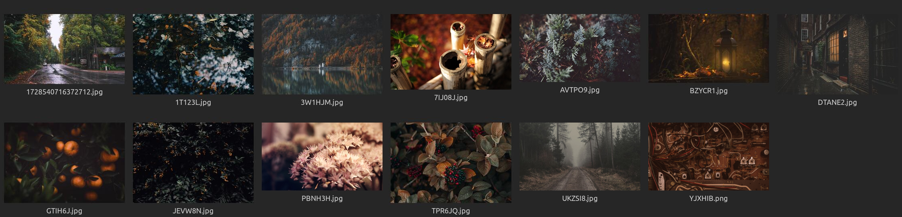

# Wallpapers

> [!NOTE] This README is autogenerated. You may view it's source code [here](https://github.com/andrewzn69/wallpapers/tree/main/.github/workflows). I do not own these images. All credits belong to the respective artists.[carbon](https://github.com/andrewzn69/wallpapers/tree/main/carbon.png)

---
[catpuccin](https://github.com/andrewzn69/wallpapers/tree/main/catpuccin.png)

---
[gruvbox](https://github.com/andrewzn69/wallpapers/tree/main/gruvbox.png)

---
[onedark](https://github.com/andrewzn69/wallpapers/tree/main/onedark.png)

---
[nord](https://github.com/andrewzn69/wallpapers/tree/main/nord.png)

---
[everforest](https://github.com/andrewzn69/wallpapers/tree/main/everforest.png)

---
